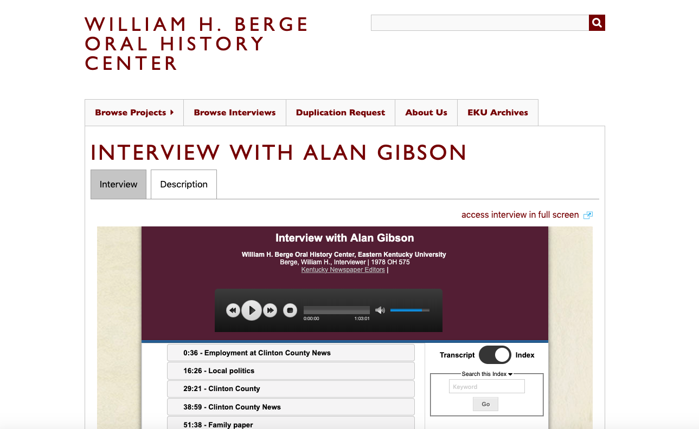
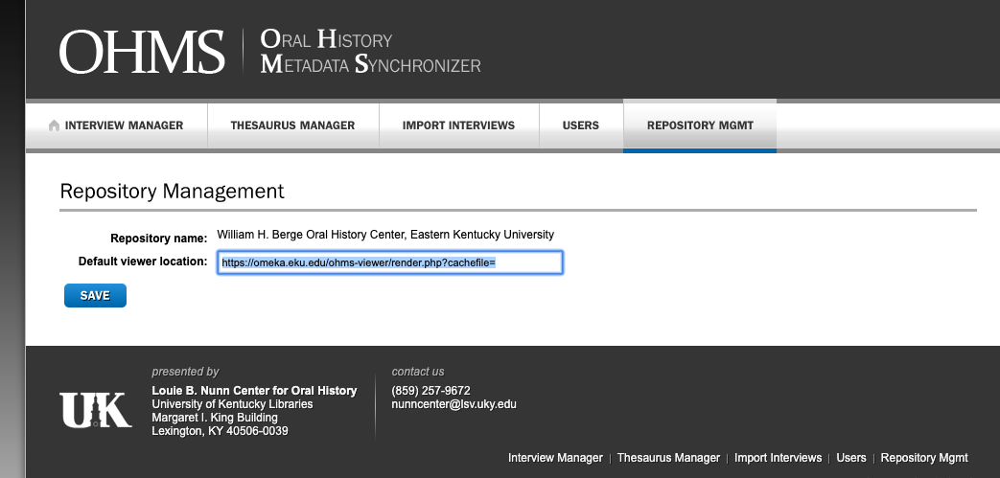

# generate_ohms_object_field
A MySQL stored procedure to Generate OHMS Object Field for any Items with an XML and a valid prefix

## OHMS: Manually Generating Missing OHMS Object URLs

On the Oral History site the OHMS viewer is dynamically displayed when Omeka detects that an Oral History typed Item contains a value in the OHMS Object metadata field. The expected value is a URL that points to the OHMS cached XML file. Example: 

When this is successful, the page will display as shown below:

The OHMS plugin suite is supposed to auto-generate this field for all Oral History type Items created in Omeka. It does this by pulling the element_text value for the XML file (db element_id = 89) and appending that to the URL prefix that we have set in the Repository Manager section of our OHMS Portal (image below); That new string value is inserted into the omek_element_texts table with an element_id of 94 and a text value that corresponds to the URL. 

For various reasons, and because we retrofitted our Omeka installation to work with these plugins, this field NOT always successfully generated. When there is a valid XML file but no URL is created in the OHMS Object metadata field, the result is a blank screen on the Items/show page on the website. The impact is that users cannot access the audio or see the indexing. 

To remedy this I created a stored procedure in MySQL that pulls all of the Oral History Object Items that contain an XML Field and not Ohms Object field, and adds a valid, working URL to the OHMS Object field for each item.

To update this field for all Oral History Items that meet this criteria, simply call the stored procedure by executing:

`call generate_ohms_objects();` 

and committing. Verify your changes in a browser window and sanity-check the impacted Items.

The full text of the procedure is as follows:

CREATE DEFINER=`orahistory`@`localhost` PROCEDURE `generate_ohms_objects`()
BEGIN

-- vars for end-state handler (done) and ID placeholder
DECLARE done BOOLEAN DEFAULT 0;
DECLARE ID INT;

-- cursor goes here, gets all the needed IDs
DECLARE ids_wo_ohms_obj CURSOR 
FOR
	SELECT 
		record_id 
	FROM oralhistory.omeka_element_texts
    WHERE record_id NOT IN (
		-- a subquery to pull all of the ids where the DON'T have an OHMS Object field but DO have an XML
        -- this speeds up the query in future use cases where we don't want to affect existing Items
		SELECT 
			record_id 
		FROM oralhistory.omeka_element_texts 
        WHERE element_id <> 94
	) AND 
		element_id = 89;

-- continue clause
DECLARE CONTINUE HANDLER FOR SQLSTATE '02000' SET done=1;

-- open up the cursor
OPEN ids_wo_ohms_obj;

-- loop through the IDs and insert new rows for each
REPEAT
	FETCH ids_wo_ohms_obj INTO ID;
    
    SELECT 
	`text` 
	INTO
		@xml_text
	FROM
		oralhistory.omeka_element_texts 
	WHERE
		record_id = ID and element_id = 89;
    
	SET @prefix_url = 'https://omeka.eku.edu/ohms-viewer/render.php?cachefile=';

	SET @ohms_object_text = concat(@prefix_url, @xml_text);

	INSERT INTO oralhistory.omeka_element_texts(record_id, record_type, element_id, html, `text`)
	VALUES(ID, 'Item', 94, 0, @ohms_object_text);
UNTIL done END REPEAT;
CLOSE ids_wo_ohms_obj;
END

